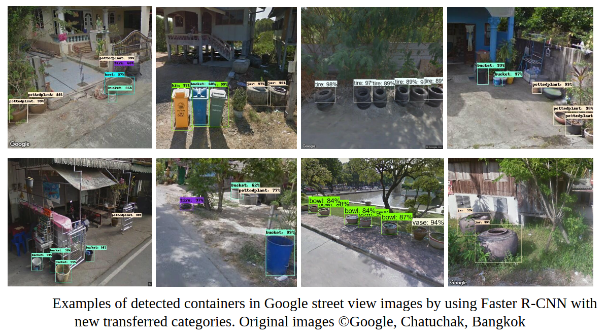
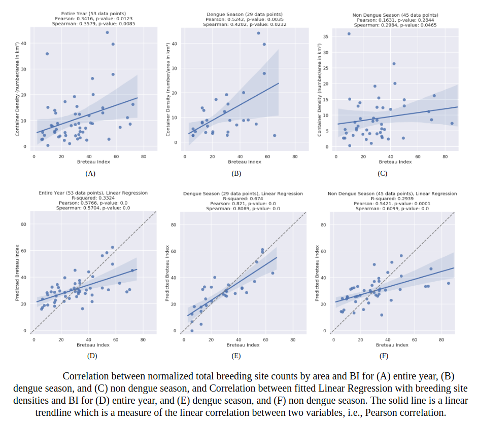
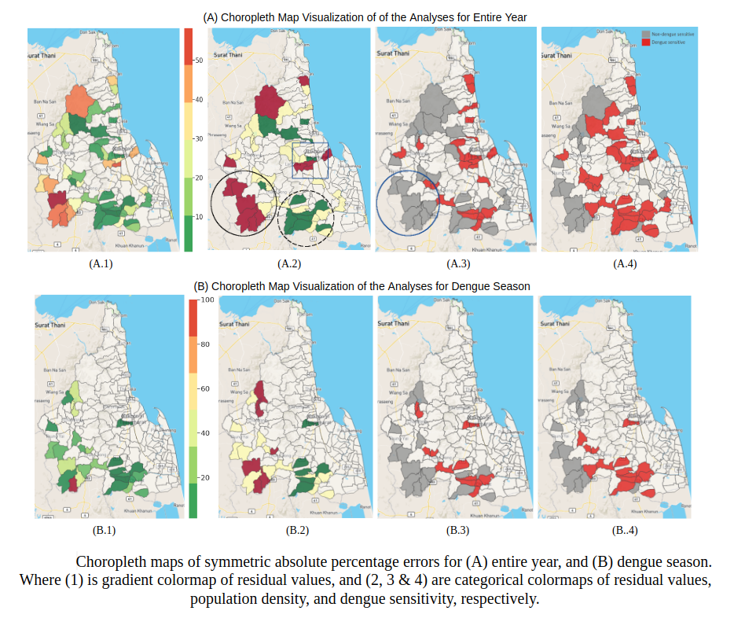
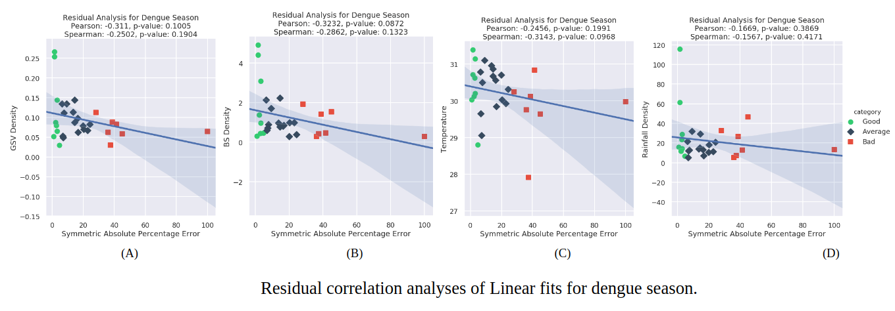
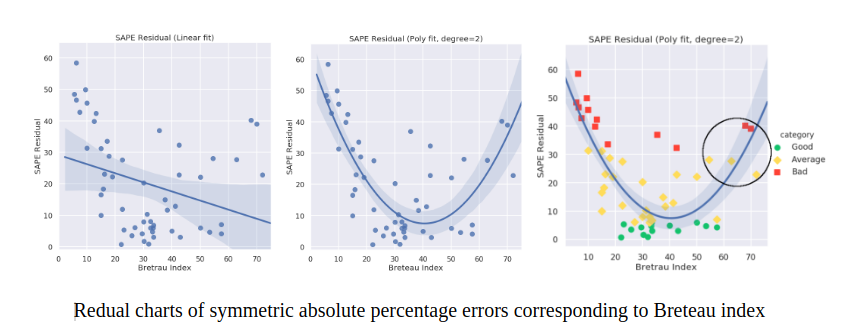
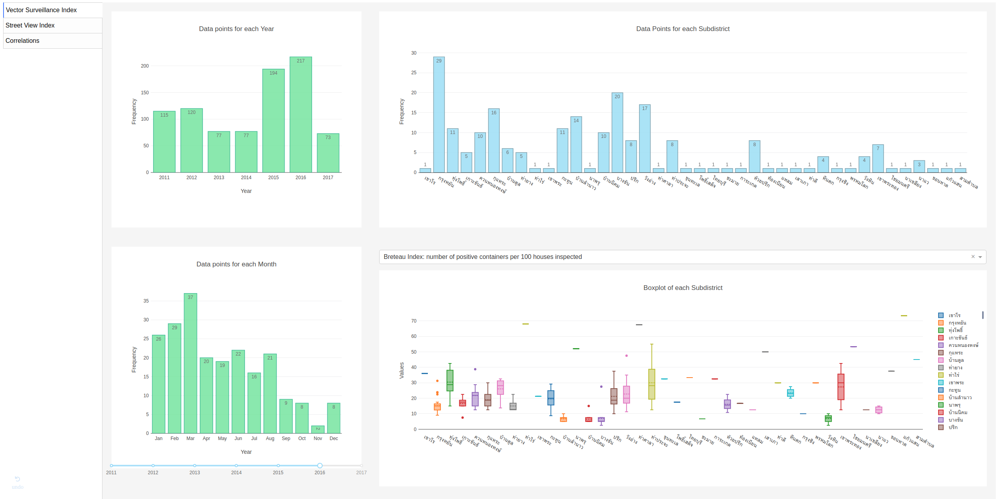
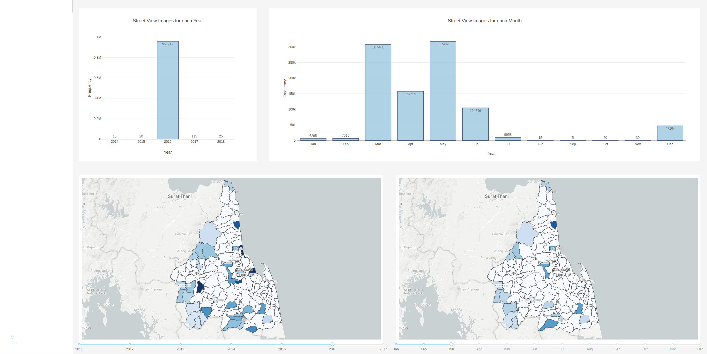

# Dengue Dash
Measurement of automated breeding site detection system by correlating fitted regression from breeding site features with traditional manual surveys.


## How It Works

### Breeding Sites Detection
 

### Correlation between Proposed Detection System and Traditional Approach
 

### Residual Analysis

 
 


## Getting Started
### Prerequisites

```python
$ pip3 install -r requirements.txt 
```


## Why?
Why not.

## Visualization Dashboard (*Deprecated*)
 
 

### How to run  (*Deprecated*)
from ./dashboard/
```
$ python3 index.py
```

## Code Description
* Correlation:
* Exploratory Data Analysis:

## Data
* Breeding-sites:
* Dengue-cases:
* Shapefile:
* [Weather](http://predict.dld.go.th/%E0%B8%82%E0%B9%89%E0%B8%AD%E0%B8%A1%E0%B8%B9%E0%B8%A5%E0%B8%A0%E0%B8%B2%E0%B8%A2%E0%B9%83%E0%B8%99%E0%B8%84%E0%B8%A5%E0%B8%B1%E0%B8%87%E0%B8%82%E0%B9%89%E0%B8%AD%E0%B8%A1%E0%B8%B9%E0%B8%A5/%E0%B8%82%E0%B9%89%E0%B8%AD%E0%B8%A1%E0%B8%B9%E0%B8%A5%E0%B8%AA%E0%B8%A0%E0%B8%B2%E0%B8%9E%E0%B8%AD%E0%B8%B2%E0%B8%81%E0%B8%B2%E0%B8%A8):

## Built With
* [Plotly Dash](https://plot.ly/products/dash/): a Python framework for building web applications written on top of Flask, Plotly.js, and React.js.
* [Scikit-learn](http://scikit-learn.org/stable/index.html): a Machine Learning in Python.